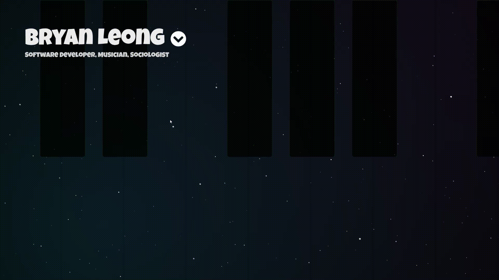

# home

My personal homepage — [leongbryan.github.io/home](https://leongbryan.github.io/home/)

## v2 — complete redesign

A ground-up rewrite. The site is now a four-panel, scroll-driven experience with
cross-fading sections driven by a lerped scroll float:

- **Home** — deep-space canvas, chromatic glitch name, a role cycler
  (DevOps · Music · Worship · Sociology), floating code/music symbols, and an SVG waveform.
- **Music** — a giant 3D vinyl disc that rotates in and out on scroll, `BLEONG MUSIC`
  rim text via SVG `textPath`, an aurora glow, film-grain overlay, and a vinyl-crackle canvas.
- **Code** — matrix rain, a circuit grid, a typewriter terminal, and CNCF badges.
- **Projects** — a cork pinboard with spring-damper physics sway, mouse parallax,
  warm amber fairy lights, a wooden frame border, and a dust-mote canvas.

Plus a custom cursor + trail, scroll progress bar, section badge, and gold-dot nav.
Type is set in Space Grotesk + JetBrains Mono.

## The old version

The previous homepage was a piano app over a starfield, with click ripples and a
link to my portfolio. It was a fun, playful page — but heavy on mobile and a bit
laggy, which is why it got retired. Keeping the gif around because it still looks great:

### Old credits

- Sparks animation: [Wayne Thursby](https://codepen.io/1srq)
- Space background: [Hakimel](https://codepen.io/hakimel)
- Ripple on click: [Bret Cameron](https://css-tricks.com/author/)
